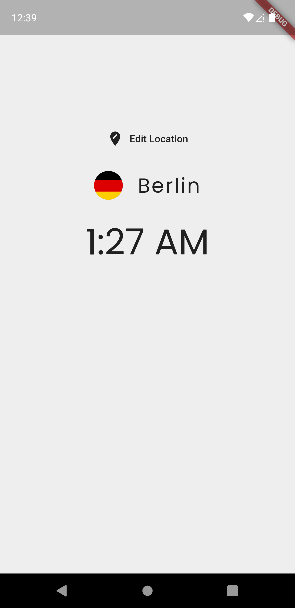

# World Time App

A Flutter 2.10.15 project, with the intent of displaying the time in different locations.

## How was develop

This project was construted following the series of videos tutorial for begginers of Flutter, of the youtube channel The Net Ninja. For more info, please acess the referenced [playlist](https://youtube.com/playlist?list=PL4cUxeGkcC9jLYyp2Aoh6hcWuxFDX6PBJ). 

<!--  -->

